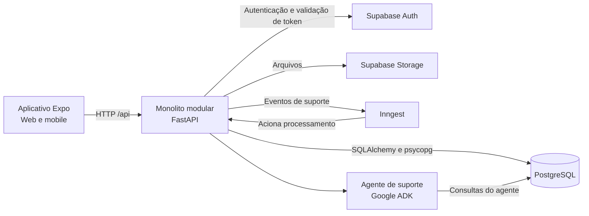

# Arquitetura do sistema

## Estilo arquitetural

O sistema é um **monolito modular**. O backend é uma única aplicação FastAPI,
organizada em módulos de domínio que compartilham o mesmo processo, configuração
e banco relacional. Os módulos separam responsabilidades por área do negócio;
eles não são serviços independentes implantados separadamente.

O repositório reúne essa API e um aplicativo multiplataforma. O aplicativo usa
Expo, React Native e TypeScript e pode ser executado em dispositivos móveis e na
web. A API concentra regras de negócio e acesso aos dados; o aplicativo consome
essas capacidades por HTTP.



## Aplicativo multiplataforma

O mesmo aplicativo atende navegador e dispositivos móveis com React Native. O
Expo fornece o ambiente de execução, o Expo Router organiza a navegação e
NativeWind aplica os estilos. As telas e serviços são agrupados por domínio; há
componentes, autenticação e comunicação HTTP compartilhados entre as áreas.

As áreas do aplicativo são: autenticação, usuários, clientes, contatos,
solicitações, orçamentos, recursos, tradutores, ordens de serviço, alocações,
convites, painel, início, suporte e agente de suporte. A presença de uma área no
aplicativo não significa que todas as operações correspondentes já estejam
disponíveis na API.

## Backend: monolito modular

As rotas da API são publicadas sob `/api`. Em geral, cada domínio separa o
recebimento das requisições, a validação dos dados, as regras de negócio, o
acesso ao banco e os modelos persistidos. Os módulos mais completos também
mantêm testes próprios. Nem todo domínio possui todas essas camadas ou o mesmo
nível de operações expostas.

| Módulo                | Responsabilidade principal                                                                                                       |
| --------------------- | -------------------------------------------------------------------------------------------------------------------------------- |
| Autenticação          | Login, recuperação de senha, validação de sessão e acesso ao provedor de autenticação.                                           |
| Usuários              | Dados e identidade dos usuários do sistema. O grupo de rotas não expõe operações próprias.                                       |
| Clientes              | Cadastro e consulta de empresas clientes.                                                                                        |
| Contatos              | Cadastro e manutenção de contatos vinculados às empresas.                                                                        |
| Recursos              | Grupo de rotas reservado, sem operações ou modelos de domínio implementados atualmente.                                          |
| Tradutores            | Cadastro e manutenção de tradutores, qualificações, especialidades e pares de idiomas.                                           |
| Orçamentos            | Solicitações de tradução, documentos, itens e geração de orçamento a partir de uma solicitação aprovada.                         |
| Ordens de serviço     | Projetos de tradução, itens, arquivos e convites enviados a tradutores. Também permite criar uma ordem a partir de um orçamento. |
| Alocações             | Grupo de rotas reservado, sem operações ou modelos de domínio implementados atualmente.                                          |
| Parâmetros do sistema | Catálogo de idiomas disponibilizado à aplicação sob a área de suporte.                                                           |
| Agente de suporte     | Responde perguntas diretamente ou por processamento assíncrono; suas ferramentas consultam dados do sistema.                     |

Além desses domínios, há suporte para carga de dados locais de desenvolvimento.
Isso é uma ferramenta de ambiente, não um domínio de negócio da API.

## Persistência e serviços externos

O PostgreSQL armazena os dados relacionais. O backend abre sessões com
SQLAlchemy e acessa o banco diretamente usando psycopg. As tabelas incluem
empresas, contatos, usuários, solicitações, orçamentos, itens de tradução,
ordens de serviço, arquivos associados, tradutores e convites.

No ambiente local, Docker Compose inicia o PostgreSQL e serviços compatíveis com
Supabase, incluindo autenticação, REST, armazenamento de arquivos e gateway. O
login passa pela API e pelo Supabase Auth; as credenciais de sessão retornadas
são enviadas pelo aplicativo nas chamadas autenticadas. O documento enviado
junto a uma solicitação é armazenado como dado binário no PostgreSQL. Arquivos
de itens de orçamento e de ordens de serviço são enviados ao Supabase Storage;
suas URLs ficam nos registros correspondentes.

As mudanças de estrutura do banco são versionadas como migrations SQL. Alembic
compara os modelos com o banco para gerar as alterações; a aplicação executa as
migrations pendentes. Veja o
[guia de migrations](<./Guia de Models e Migrations no Backend com SQLAlchemy e Alembic.md>).

## Fluxos entre módulos

### Solicitação e orçamento

Uma solicitação de tradução pode ser recebida sem que o solicitante tenha uma
conta interna. Ela registra os dados de contato, o par de idiomas, a necessidade
e, quando enviado, o documento. Após a aprovação da solicitação, o módulo de
orçamentos cria um orçamento com os dados reaproveitados e permite associar
itens de tradução.

### Orçamento e ordem de serviço

O módulo de ordens de serviço tem uma operação que recebe um orçamento e cria o
projeto copiando seus itens de tradução. No estado atual do backend, essa
operação está separada da decisão de aprovar o orçamento e não verifica por si
só se o status do orçamento é aprovado. A criação exclusivamente após a
aprovação não é aplicada por essa operação no backend atual.

### Ordem de serviço e alocação de tradutores

Uma ordem de serviço contém itens de tradução e pode receber convites para
tradutores. O tradutor consulta os convites associados à própria sessão e pode
aceitar ou recusar. Quando um convite é aceito, o item começa a ser executado e
os demais convites pendentes para aquele item são expirados.

### Agente de suporte

O suporte oferece um caminho de resposta direta e outro assíncrono, coordenado
por Inngest. O agente usa Google ADK e ferramentas que consultam dados do banco.
As rotas atuais do agente não declaram uma dependência de autenticação; as
consultas do agente, portanto, não recebem a identidade autenticada do
solicitante.

## Limites e pontos de atenção

- O aplicativo já possui áreas para recursos, alocações e usuários, mas os
  respectivos grupos de rotas do backend ainda não oferecem operações próprias.
- A geração de ordem de serviço a partir de orçamento não aplica atualmente a
  condição de status aprovado no backend.
- A maioria dos módulos compartilha o mesmo banco; separação por domínio no
  código não equivale a isolamento de dados ou implantação independente.

## Execução local e qualidade

```bash
docker compose up -d
pnpm dev
```

Também é possível iniciar separadamente o aplicativo ou a API. O backend usa
pytest, Ruff e mypy; o aplicativo usa TypeScript, ESLint e Playwright. A CI e
seus critérios estão descritos no [guia de CI](<./CI - GitHub Actions.md>).
